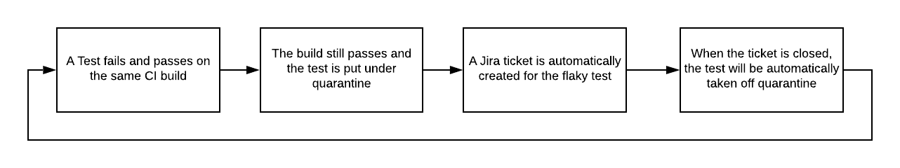

# Quarantine
[](https://travis-ci.com/flexport/quarantine)

Quarantine provides a run-time solution to diagnosing and disabling flaky tests and automates the workflow around test suite maintenance.

The quarantine gem supports testing frameworks:
- [RSpec](http://rspec.info/)

The quarantine gem supports any CI pipeline.

If you are interested in using quarantine but it does not support your CI or testing framework, feel free to reach out or create an issue and we can try to make it happen.

## Purpose
Flaky tests impact engineering velocity, reduce faith in test reliablity and give a false representation of code coverage. Managing flaky tests is a clunky process that involves constant build monitorization, difficult diagnosis and manual ticket creation. As a result, here at Flexport, we have created a Gem to automate the entire process to help improve the workflow and keep our massive test suites in pristine condition.

The workflow at Flexport involves:



---
## Installation and Setup

Add these lines to your application's Gemfile:
```rb
group :test do
  gem 'quarantine'
  gem 'rspec-retry'
end
```

And then execute:
```sh
bundle install
```

In your `spec_helper.rb` setup quarantine and rspec-retry gem. Click [rspec-retry](https://github.com/NoRedInk/rspec-retry) to get a more detailed explaination on rspec-retry configurations and how to setup.
```rb
require 'quarantine'
require 'rspec-retry'

Quarantine.bind_rspec

RSpec.configure do |config|
  # Also accepts `credentials` to override the standard AWS credential chain
  config.quarantine_database = {type: :dynamodb, region: 'us-west-1'}

  config.around(:each) do |ex|
    ex.run_with_retry(retry: 3)
  end

end
```

Consider wrapping `Quarantine.bind` in if statements so local flaky tests don't pollute the list of quarantined tests

```rb
if ENV[CI] && ENV[BRANCH] == "master"
  Quarantine.bind_rspec
end
```

Setup tables in AWS DynamoDB to support pulling and uploading quarantined tests
```sh
bundle exec quarantine_dynamodb -h    # see all options

bundle exec quarantine_dynamodb \     # create the tables in us-west-1 in aws dynamodb
  --region us-west-1                  # with "test_statuses" table name
```

You are all set to start quarantining tests!

## Try Quarantining Tests Locally
Add a test that will flake
```rb
require "spec_helper"

describe Quarantine do
  it "this test should flake 33% of the time" do
    Random.rand(3).to eq(3)
  end
end
```

Run `rspec` on the test
```sh
CI=1 BRANCH=master rspec <filename>
```

If the test fails and passes on the test run (rspec-retry re-ran the test), the test should be quarantined and uploaded to DynamoDB. Check the `test_statuses` table in DynamoDB.

## Configuration

Go to `spec/spec_helper.rb` and set configuration variables through:
```rb
RSpec.configure do |config|
    config.VAR_NAME = VALUE
end
```
- Table name for test statuses `:test_statuses_table, default: "test_statuses"`

- Skipping quarantined tests during test runs `:skip_quarantined_tests, default: true`

- Recording test statuses `:quarantine_record_tests, default: true`

- Outputting quarantined gem info `:quarantine_logging, default: true`

- Storing custom per-example attributes in the table `:quarantine_extra_attributes, default: ->(example) { {} }`

---
## Setup Jira Workflow

```rb
RSpec.configure do |config|
  # Store Buildkite build number alongside test in database tables
  config.extra_attributes = ->(example) { {
    build_number: ENV['BUILDKITE_BUILD_NUMBER'] || '-1',
  } }
```

To automatically create Jira tickets, take a look at: `examples/create_tickets.rb`

To automatically unquarantine tests on Jira ticket completion, take a look at: `examples/unquarantine.rb`

---
## Contributing
1. Create an issue regarding a bug fix or feature request
2. Fork the repository
3. Create your feature branch, commit changes and create a pull request

## Contributors
- [Eric Zhu](https://github.com/eric-zhu-uw)
- [Kevin Miller](https://github.com/Gasparila)
- [Nicholas Silva](https://github.com/flexportnes)
- [Ankur Dahiya](https://github.com/legalosLOTR)
---

## FAQs

#### Why are quarantined tests not being skipped locally?

The `quarantine` gem may be configured to only run on certain environments. Make sure you pass all these `ENV` variables to `rspec` when you call it locally

```sh
CI="1" BRANCH="master" rspec
```

#### Why is dynamodb failing to connect?

The AWS client loads credentials from the following locations (in order of precedence):
- The optional `credentials` field in `RSpec.configuration.quarantine_database`
- `ENV['AWS_ACCESS_KEY_ID']` and `ENV['AWS_SECRET_ACCESS_KEY']`
- `Aws.config[:credentials]`
- The shared credentials ini file at `~/.aws/credentials`

To get AWS credentials, please contact your AWS administrator to get access to dynamodb and create your credentials through IAM.

More detailed information can be found: [AWS documentation](https://docs.aws.amazon.com/sdkforruby/api/Aws/S3/Client.html)
